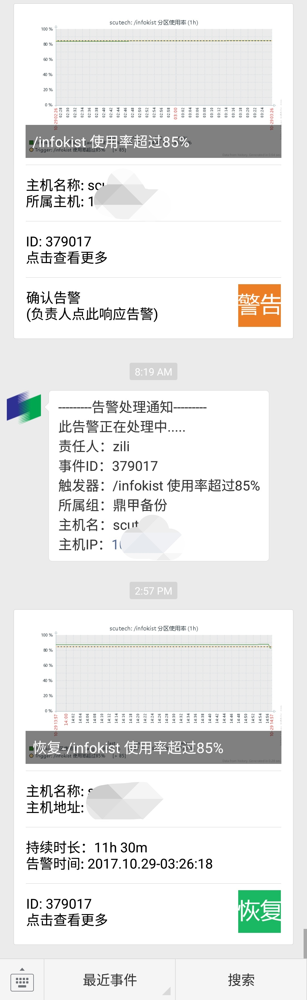

# zbx-wechat
Zabbix推送告警到企业微信

告警

{TRIGGER.STATUS}&&{TRIGGER.SEVERITY}&&{EVENT.ID}&&{TRIGGER.HOSTGROUP.NAME}&&{HOST.NAME}&&{HOST.IP}&&{EVENT.DATE}&&{EVENT.TIME}&&{TRIGGER.DESCRIPTION}&&{ITEM.ID}&&{TRIGGER.NAME}

恢复

{TRIGGER.STATUS}&&{TRIGGER.SEVERITY}&&{EVENT.ID}&&{TRIGGER.HOSTGROUP.NAME}&&{HOST.NAME}&&{HOST.IP}&&{EVENT.DATE}&&{EVENT.TIME}&&{TRIGGER.DESCRIPTION}&&{ITEM.ID}&&{TRIGGER.NAME}&&{EVENT.AGE}&&{EVENT.RECOVERY.DATE}&&{EVENT.RECOVERY.TIME}

动作关联两个脚本,graph和wechat,一个建图,一个发消息
